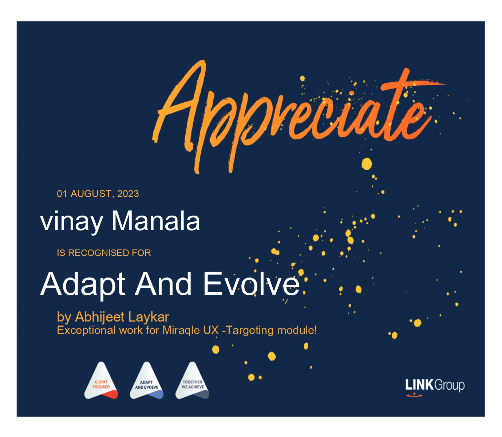
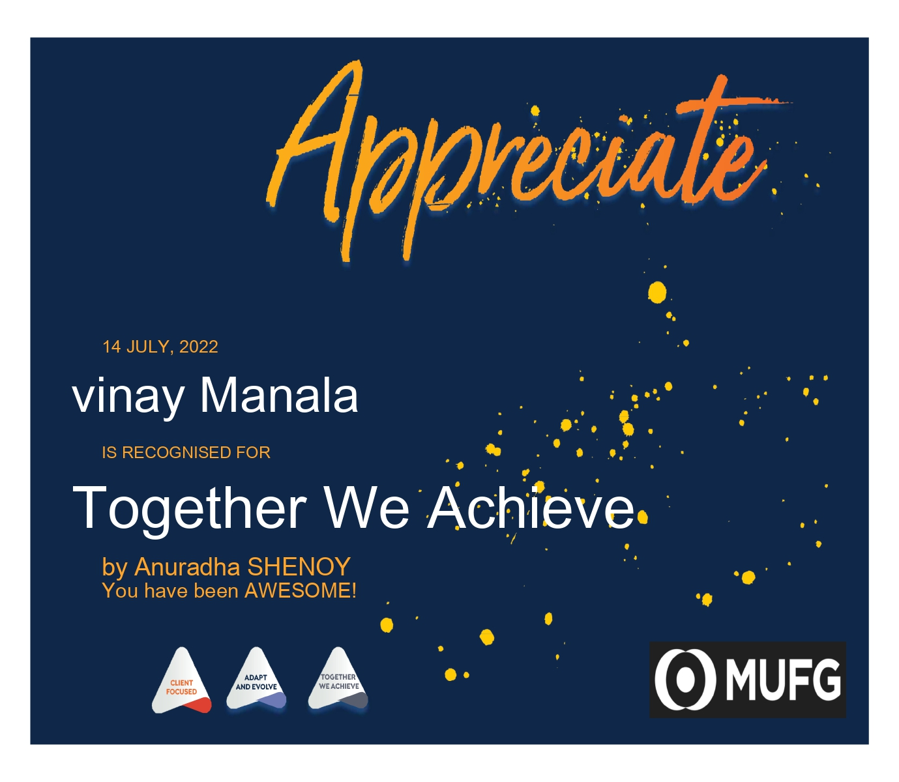
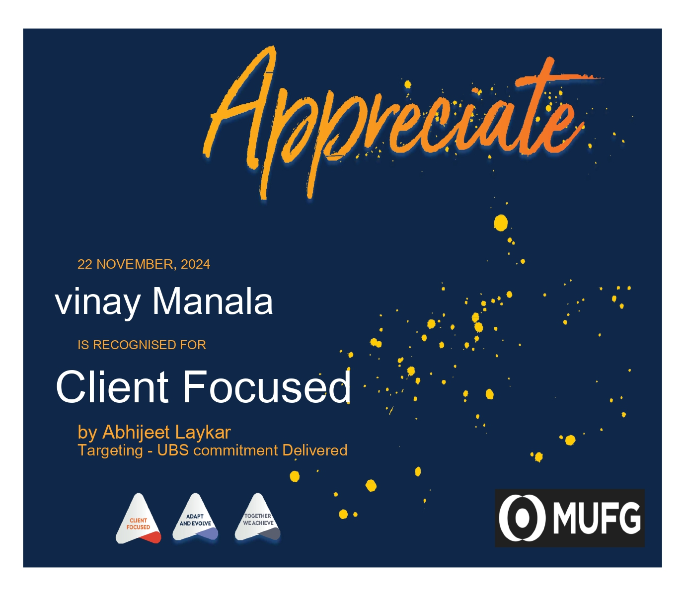
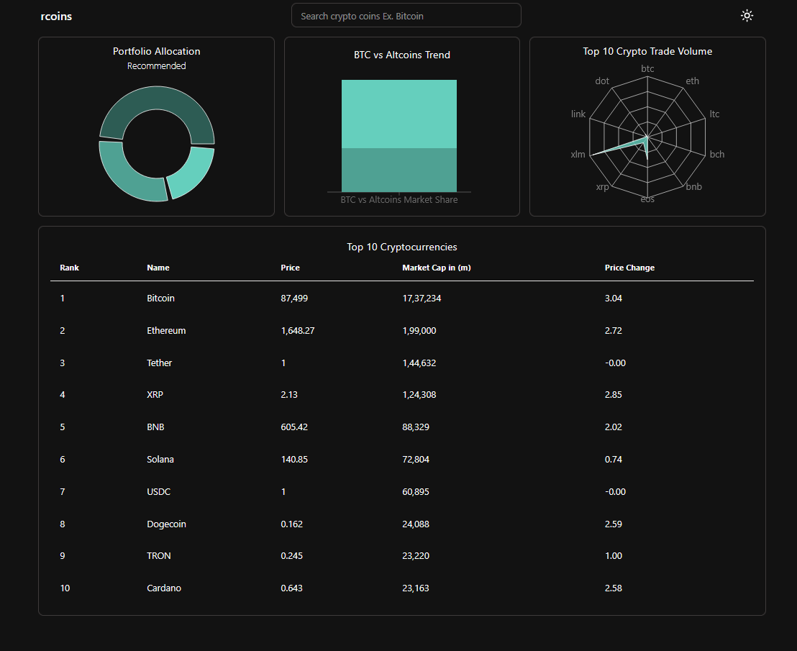
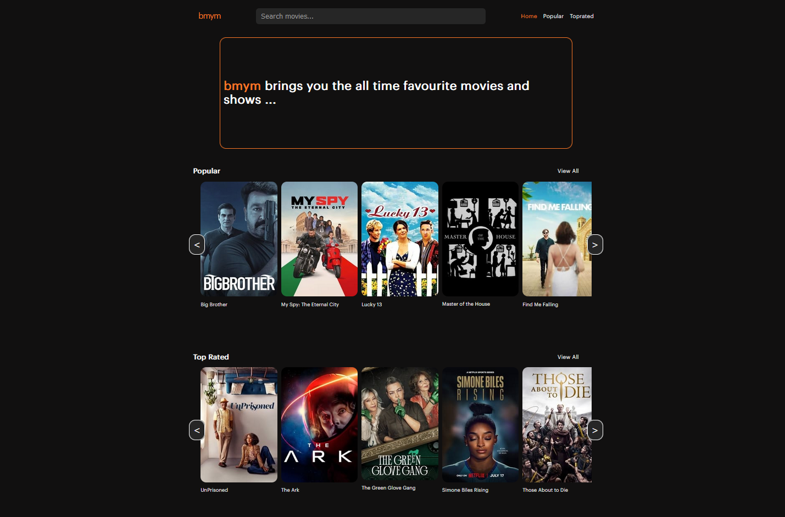
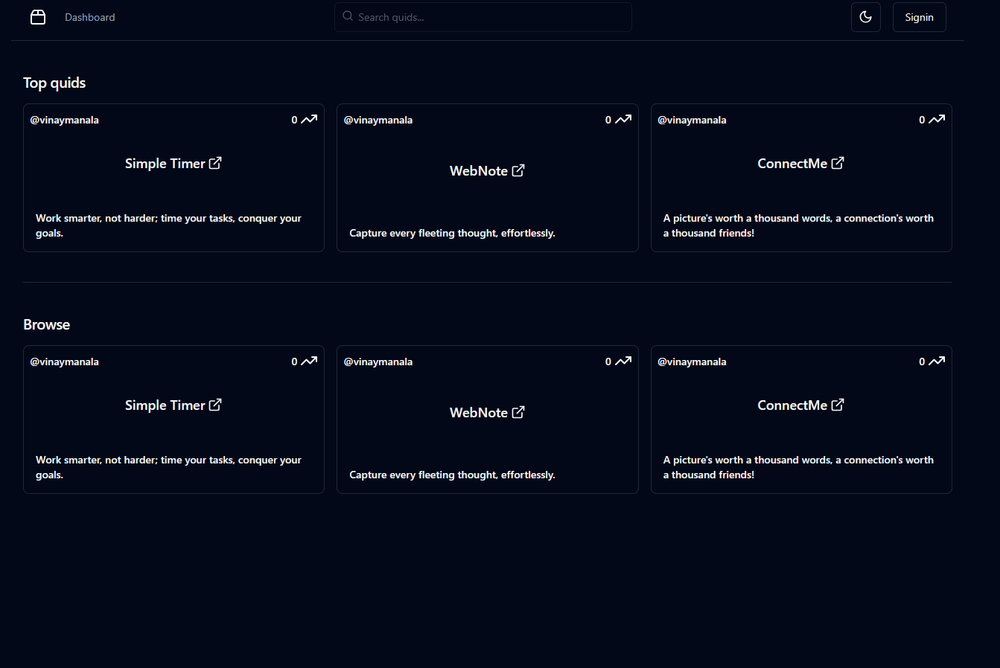

## About me

## Hi, I'm Vinay,

<i>Software Engineer specializing in Backend for Frontend (BFE) web development. Currently expanding my expertise in System Design, Distributed Systems, and Micro-Frontend (MFE).</i>

I currently live in the Mumbai Metropolitan Area of Maharashtra with
my parents. I had started programming when I took electronics as my
engineering path. Since then I have been building projects and
learning new technologies.

I am a frontend developer, an aspiring full stack developer. I
curently work for a Fintech Company, where I develop financial web
applications for the company built with Reactjs as Frontend. I am
currently investing my time in learning current technologies around
web development, cloud architecture and infrastructure, design
systems and many more. Apart from this In my free time I binge shows
and movies with Sci-fi, Thriller, Adventure genre. I also keep in
touch with the financial system and news as well which is very
essential nowadays.

## Socials:

[Github](https://github.com/vinaymanala "Github")
[LinkedIn](https://www.linkedin.com/in/vinaymanala/ "LinkedIn")
[Twitter](https://twitter.com/vinaymanala/ "Twitter")
[Youtube](https://www.youtube.com/channel/UCXs7GazVR7nHPTJGAcAm3fg "Youtube")

## Achievements I have recieved from my recent company:

## Some of the videos I have created:

<iframe width="560" height="315" alt="YoutubeVideo" src="https://www.youtube.com/embed/VyjnPbV8iZo?si=pE1_KsQqJ9s_Sk0Y" title="Disaster Delineation Project Video" frameborder="0" allow="accelerometer; autoplay; clipboard-write; encrypted-media; gyroscope; picture-in-picture; web-share" referrerpolicy="strict-origin-when-cross-origin" allowfullscreen></iframe>
<iframe width="560" height="315" alt="YoutubeVideo" src="https://www.youtube.com/embed/QW0gUWYKQa0?si=N5HlxeGVzGk535tL" title="Bug Tracking System Youtube Video" frameborder="0" allow="accelerometer; autoplay; clipboard-write; encrypted-media; gyroscope; picture-in-picture; web-share" referrerpolicy="strict-origin-when-cross-origin" allowfullscreen></iframe>
<iframe width="560" height="315" alt="YoutubeVideo" src="https://www.youtube.com/embed/BmBP9zd84zI?si=wdKqQHiHd2E5lsFv" title="ReactJS Stripe Payment Gateway Youtube Video" frameborder="0" allow="accelerometer; autoplay; clipboard-write; encrypted-media; gyroscope; picture-in-picture; web-share" referrerpolicy="strict-origin-when-cross-origin" allowfullscreen></iframe>
<iframe width="560" height="315" alt="YoutubeVideo" src="https://www.youtube.com/embed/-Dl09BGgZqM?si=sVaTR0i9vJ5j_CoL" title="Decentralized Asset Tracking System Using Blockchain Technology Youtube Video Part - 1" frameborder="0" allow="accelerometer; autoplay; clipboard-write; encrypted-media; gyroscope; picture-in-picture; web-share" referrerpolicy="strict-origin-when-cross-origin" allowfullscreen></iframe>
<iframe width="560" height="315" alt="YoutubeVideo" src="https://www.youtube.com/embed/M1FLukYPGvI?si=R3DT7nRTVS-kLmWw" title="Decentralized Asset Tracking System Using Blockchain Technology Youtube Video Part - 2" frameborder="0" allow="accelerometer; autoplay; clipboard-write; encrypted-media; gyroscope; picture-in-picture; web-share" referrerpolicy="strict-origin-when-cross-origin" allowfullscreen></iframe>
<iframe width="560" height="315" alt="YoutubeVideo" src="https://www.youtube.com/embed/4U-swGnxnKs?si=s3MVyJtMx757DbCe" title="iRotot Simulation Youtube Video" frameborder="0" allow="accelerometer; autoplay; clipboard-write; encrypted-media; gyroscope; picture-in-picture; web-share" referrerpolicy="strict-origin-when-cross-origin" allowfullscreen></iframe>

<!-- 

 -->

#### [Decentralized Asset Tracking System](https://www.youtube.com/watch?v=-Dl09BGgZqM&ab_channel=ManalaMedia)

Asset Tracking System for Vaccine aims to build a software as a
service(SaaS) for Vaccine Tracking(can be also used as a FCMG
goods) tracking service. This service follows the Governance to
General Public type of architecture. The supply chain management
system involves tracking of the products shipment and vehicle
tracking facilities which will be visible on the real time map
provided for the general public.

#### [Bug Tracking System](https://www.youtube.com/watch?v=QW0gUWYKQa0&ab_channel=ManalaMedia)

"Bug Tracking System" allows to track the status of the bug
report and address it to the developers community experiences.

#### [Disaster Delineation App](https://www.youtube.com/watch?v=VyjnPbV8iZo&ab_channel=ManalaMedia)

"Disaster Delineation App" is a software tool to analyze the
real time disaster events occuring from around the world.

## Some of the projects I have build:

#### [Cryptocurrency Dashboard (Rcoins)](https://rcoins.vercel.app/)

Displays the top trending and latest data for cryptocurencies.

#### [Project Idea Document creator uing AI (Rquid)](https://rquid-client.onrender.com/)

A project idea document creator using AI which creates projects within minutes.

#### [Movies website (bookyMyMovies)](https://bmym.netlify.app/)

A movies web application built using Reactjs library with public apis available.

#### [Simple todo-tasks-manager](https://todotasksmanager.netlify.app/)

A simple todo-tasks-manager build using vanilla javascript, html, css.
